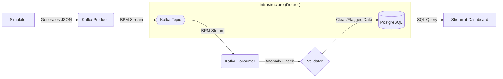

# Heartbeat Monitor: Real-Time Health Streaming Pipeline

A robust, enterprise-grade data engineering pipeline designed to monitor customer heartbeat data in real-time. This project leverages **Kafka** for distributed streaming, **PostgreSQL** for persistent storage, and **Streamlit** for live visualization.

<<<<<<< HEAD

## Architecture Overview
=======
## Architecture Overview
>>>>>>> 0fba4929f4fd72c7fdd479f2be18196e04d65ff6

The system follows a microservices-based streaming architecture:

<<<<<<< HEAD
### Data Flow
1.  **Simulation**: The `simulator` generates synthetic heartbeat events (JSON) with realistic variability and random anomalies.
2.  **Ingestion**: The **Kafka Producer** pushes these events to the `heartbeat_data` topic.
3.  **Processing**: The **Kafka Consumer** subscribes to the topic, receiving messages in real-time.
4.  **Validation**: Each heart rate is checked against medical thresholds:
    *   **Bradycardia**: < 50 BPM
    *   **Tachycardia**: > 110 BPM
    *   **Normal**: 50 - 110 BPM
5.  **Storage**: Validated data is inserted into a **PostgreSQL** database.
6.  **Visualization**: The **Streamlit Dashboard** queries the DB every second to update live charts and metrics.

## Key Features
=======
## Key Features
>>>>>>> 0fba4929f4fd72c7fdd479f2be18196e04d65ff6

*   **Real-time Streaming**: Continuous data ingestion using high-throughput Kafka topics.
*   **Intelligent Validation**: Automatic detection of health anomalies.
*   **System Resilience**: Robust retry logic with **Exponential Backoff** (using `tenacity`) for DB and Kafka connections.
*   **Persistent Storage**: Docker-managed volumes ensure data survival across system restarts.
*   **Centralized Logging**: Structured, rotating file logging in the `logs/` directory.
*   **Live Visual Insights**: Interactive dashboard with trend lines and pie charts.

## Technology Stack

*   **Language**: Python 3.10+
*   **Message Broker**: Apache Kafka (Confluent 7.4.0)
*   **Database**: PostgreSQL
*   **Visualization**: Streamlit & Plotly
*   **Infrastructure**: Docker & Docker Compose
*   **Testing**: Unittest

## Project Structure

*   `config/`: Centralized settings and logging utilities.
*   `data_generator/`: Heartbeat simulation logic.
*   `producer/`: Kafka producer for data ingestion.
*   `consumer/`: Kafka consumer for validation and storage.
*   `database/`: SQL schemas and DB connection handlers.
*   `pipeline/`: Multiprocessing orchestration script.
*   `dashboard/`: Real-time Streamlit visualization app.
*   `docs/`: Detailed setup and technical guides (includes `setup_guide.md`, `sample_output.txt`).
*   `logs/`: Runtime logs (Rotating file support).
*   `tests/`: Unit tests for all modules.

---

## Quick Start

For detailed step-by-step instructions, please refer to the **[Detailed Setup Guide](docs/setup_guide.md)**.

### fast track:
1.  **Start Services**: `cd docker && docker-compose up -d`
2.  **Install Deps**: `pip install -r requirements.txt`
3.  **Run Pipeline**: `python pipeline/pipeline_runner.py`
4.  **View Dashboard**: `streamlit run dashboard/app.py`

## Troubleshooting

- **NoBrokersAvailable**: Ensure Docker is running. If on Windows, check `.env` uses `127.0.0.1`.
- **DB Auth Error**: If you changed passwords, run `docker-compose down -v` to reset the volume.
