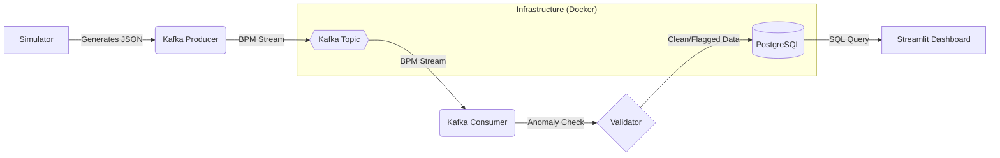

# Heartbeat Monitor: Real-Time Health Streaming Pipeline

A robust, enterprise-grade data engineering pipeline designed to monitor customer heartbeat data in real-time. This project leverages **Kafka** for distributed streaming, **PostgreSQL** for persistent storage, and **Streamlit** for live visualization.

## Architecture Overview

## Key Features

*   **Real-time Streaming**: Continuous data ingestion using high-throughput Kafka topics.
*   **Intelligent Validation**: Automatic detection of **Bradycardia** (<50 BPM) and **Tachycardia** (>110 BPM).
*   **System Resilience**: Robust retry logic with **Exponential Backoff** (using `tenacity`) for DB and Kafka connections.
*   **Persistent Storage**: Docker-managed volumes ensure data survival across system restarts.
*   **Centralized Logging**: Structured, rotating file logging in the `logs/` directory for production debugging.
*   **Live Visual Insights**: Interactive dashboard with trend lines, status distribution (Pie charts), and live log tables.

## Technology Stack

*   **Language**: Python 3.10+
*   **Message Broker**: Apache Kafka (Confluent 7.4.0)
*   **Database**: PostgreSQL
*   **Visualization**: Streamlit & Plotly
*   **Infrastructure**: Docker & Docker Compose
*   **Resilience**: Tenacity (Retry library)

## Project Structure

*   `config/`: Centralized settings and logging utilities.
*   `data_generator/`: Heartbeat simulation logic.
*   `producer/`: Kafka producer for data ingestion.
*   `consumer/`: Kafka consumer for validation and storage.
*   `database/`: SQL schemas and DB connection handlers.
*   `pipeline/`: Multiprocessing orchestration script.
*   `dashboard/`: Real-time Streamlit visualization app.
*   `docs/`: Detailed setup and technical guides.
*   `logs/`: Runtime logs (Rotating file support).

---

## Quick Start

Ready to run the system? Head over to the **[Detailed Setup Guide](docs/setup_guide.md)** for step-by-step instructions.
